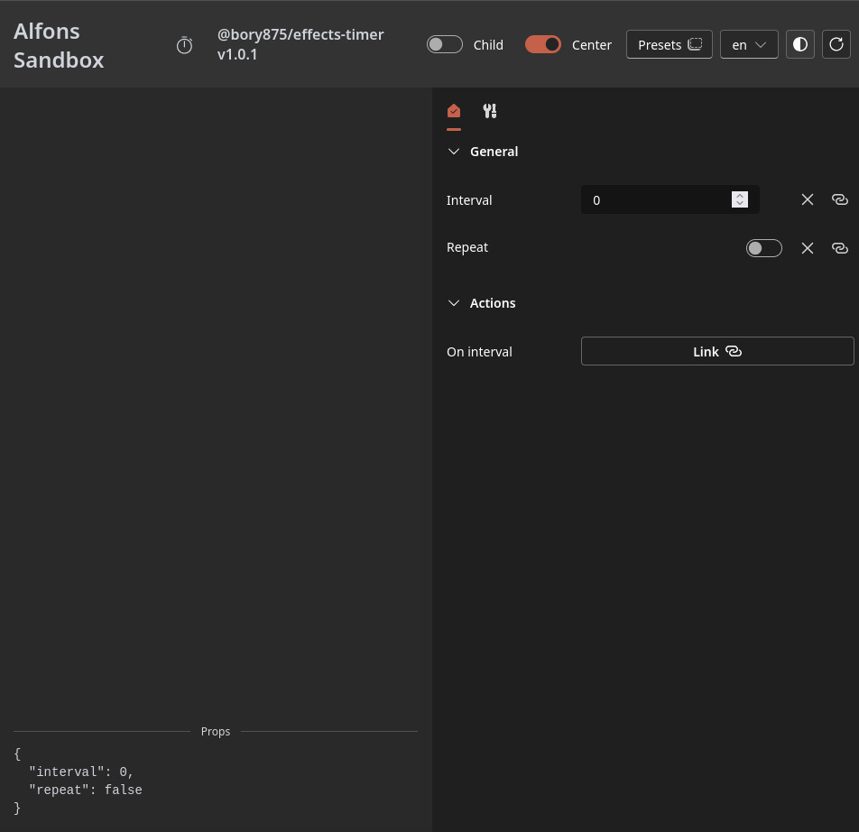

# Timer Plugin

### Instalace

1. Nastavit .npmrc pro alfons balíčky
2. Nastavit si NPM_TOKEN proměnnou prostředí
3. pnpm i
4. Je možné, že v instalaci alfons z npm chybí uuid dependency, pokud ano, je nutné ji tam ručně dopsat a nainstalovat.
5. pnpm sandbox

### Features

- Plugin poskytuje funkcionalitu timeru.
- Vlastnosti nastavitelné v editoru:
  - Délka intervalu
  - Opakování - switch
  - Akce, která se má po uplynutí intervalu spustit

